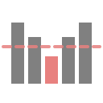

<p align="center">
  
</p>

<h1 align="center">Mire</h1>

<p align="center">
  <strong>Ce qui se passe vraiment sur votre ligne câble, mesuré en continu.</strong>
</p>

---

## Ce que fait Mire

Une connexion câble se dégrade rarement d'un coup. Le signal s'affaiblit, le bruit
monte, quelques canaux passent en modulation basse, et l'on constate surtout des
symptômes : une visio qui saute, une partie qui décroche, un débit qui s'effondre
le soir. Le modem, lui, sait exactement ce qui se passe — mais n'en garde aucune trace.

Mire interroge le modem en continu et conserve l'historique : puissances descendante
et montante, MER/SNR par canal, modulation, compteurs d'erreurs, pertes de
synchronisation. Ces mesures s'accumulent dans une base locale et deviennent lisibles :
graphiques, chronologies, alertes, comparaisons entre deux périodes.

L'usage courant est la surveillance — savoir où en est la ligne, repérer une dérive
avant qu'elle ne devienne gênante, comprendre après coup ce qui s'est passé pendant
une coupure. Et quand un problème persiste malgré les échanges avec l'opérateur, les
mêmes données produisent un dossier daté : rapport PDF, chronologie des incidents,
courrier de plainte conforme à la procédure belge.

## Fonctionnalités

**Tableau de bord.** État de santé de la ligne en un coup d'œil, avec le détail par
canal descendant et montant. Les seuils sont ceux de la pratique VOO, pas des valeurs
génériques : un signal à 8 dBmV n'est pas signalé en anomalie s'il ne pose pas de
problème en pratique.

**Historique et tendances.** Chaque mesure est conservée. On revient sur une soirée
précise, on compare une semaine à la précédente, on suit l'évolution d'un canal sur un
mois. C'est là qu'apparaissent les motifs récurrents — la dégradation quotidienne aux
heures de pointe, la dérive lente après une intervention.

**Détection d'événements.** Perte de synchronisation, chute de modulation, sortie de
plage : Mire les repère seul et les inscrit dans un journal horodaté, sans qu'il faille
regarder au bon moment.

**Corrélation.** Signal du modem, débits mesurés et événements détectés sur une même
chronologie. C'est ce qui relie un symptôme ressenti à une cause mesurable.

**Latence continue.** Sondes ICMP/TCP vers des cibles configurables, pour documenter la
perte de paquets et la gigue — invisibles dans un test de débit ponctuel.

**Journal d'incidents.** Décrire un problème, y rattacher captures et mesures, regrouper
plusieurs entrées en un incident unique.

**Rapports et plainte.** Rapport PDF d'incident, et courrier suivant la procédure belge :
plainte écrite à l'opérateur, puis saisine du Service de médiation si nécessaire.

**Notifications.** Alertes vers Home Assistant en MQTT, ou par les canaux configurés,
quand la santé de la ligne change.

## Matériel

**Modem** Technicolor CGA4233 (firmware VOO), accessible en `192.168.100.1`. Le mode
bridge n'est pas obligatoire, mais l'adresse et les identifiants sont à vérifier sur
place plutôt qu'à supposer.

**Collecteur** : Raspberry Pi 3B+ ou mieux, sous Pi OS Lite 64 bits avec Docker.
N'importe quelle machine Docker convient — NAS, Proxmox, Debian.

Un mode **routeur générique** existe pour les modems non pris en charge : les fonctions
indépendantes du modem restent disponibles, sans les données DOCSIS.

## Installation

Prérequis, puis reconnexion obligatoire pour que le groupe `docker` prenne effet :

```bash
sudo apt update && sudo apt install -y git && \
curl -fsSL https://get.docker.com | sh && \
sudo usermod -aG docker $USER && \
sudo timedatectl set-timezone Europe/Brussels
```

L'image est publiée sur GHCR depuis un dépôt privé : il faut un jeton GitHub avec les
portées `repo` et `read:packages` (Settings > Developer settings > Tokens classic).

```bash
read -rsp 'Jeton GitHub : ' T; echo
```

```bash
echo "$T" | docker login ghcr.io -u Floopich --password-stdin && \
git clone https://Floopich:$T@github.com/Floopich/mire.git ~/mire && \
cd ~/mire && git remote set-url origin https://github.com/Floopich/mire.git && \
unset T && ./scripts/site.sh start maison
```

L'interface écoute sur le port **8765**. Au premier démarrage, `http://<ip>:8765` ouvre
l'assistant : URL du modem, utilisateur, mot de passe.

## Campagne de mesure

Un dossier de données par site, pour ne pas mélanger deux lignes dans la même base.

```bash
./scripts/site.sh start dupont     # cree sites/dupont/data, ecrit .env, demarre
./scripts/site.sh archive dupont   # arrete et produit sites/dupont-AAAAMMJJ.tar.gz
./scripts/site.sh list
```

Le compte propriétaire de l'image est déduit du remote git et écrit dans `.env` au
premier `start` — rien à éditer.

### Durée

Une à deux semaines par site. Une session courte ne capte pas les dégradations d'heure
de pointe, qui sont l'essentiel de ce qu'on cherche à documenter.

### Boîtier itinérant

Trois points comptent quand le collecteur passe de ligne en ligne :

- **Une horloge sauvegardée.** Un Pi sans RTC prend l'heure par NTP au démarrage. Si la
  ligne tombe — l'événement même qu'on veut prouver — un redémarrage sans réseau repart
  sur une heure fausse et les horodatages deviennent inopposables. Un DS3231 en I²C règle
  le problème : `dtoverlay=i2c-rtc,ds3231` dans `/boot/firmware/config.txt`, puis purger
  `fake-hwclock`.
- **La carte SD s'use.** Mire écrit en continu dans SQLite. Sur une campagne longue ou
  répétée, monter `sites/` sur un SSD USB.
- **L'accès distant vaut accès à un réseau tiers.** Le prévenir, et délier l'appareil du
  compte à la fin de chaque campagne.

## Débits souscrits

Le modem n'expose aucune information WAN en mode bridge. Le rapport se replie sur les
réglages `booked_download` / `booked_upload` (Paramètres > Speedtest, en Mbit/s).

```bash
BOOKED_DOWNLOAD=1000 BOOKED_UPLOAD=50 ./scripts/site.sh start dupont
```

Non renseignés, la ligne tarifaire affiche « N/A » — préférable à la valeur d'un autre
abonnement dans un document destiné à appuyer une plainte.

## Seuils

Le profil `mire.thresholds_voo` porte les seuils utilisés pour qualifier l'état de la
ligne. Ils viennent de la pratique VOO, à deux exceptions près : les lignes `ofdm` de
`downstream_power` et `snr` s'appuient sur la spec CableLabs DOCSIS 3.1 PHY. Sans elles,
un canal OFDM serait jugé sur le `good_min` de 40 dB du 4096QAM alors que son MER agrégé
se mesure autrement, et sortirait en critique alors qu'il va bien.

Le repli codé en dur de `app/analyzer.py`, utilisé quand aucun profil n'est chargé, porte
les mêmes valeurs : une instance fraîche analyse correctement avant même l'activation du
profil.

## Courrier de plainte

Le générateur suit la procédure belge : plainte écrite au service de traitement des
plaintes de l'opérateur, puis, à défaut de solution dans un délai raisonnable, saisine du
**Service de médiation pour les télécommunications** — instance de recours gratuite
instituée auprès de l'IBPT par la loi du 21 mars 1991, entité qualifiée au sens du livre
XVI du Code de droit économique. L'IBPT ne traite pas les litiges individuels.

Disponible en français, néerlandais, allemand et anglais. Le néerlandais et l'allemand
comptent : ce sont des langues officielles belges, et la Communauté germanophone est en
Wallonie. Une locale inconnue retombe sur l'anglais.

## Modules

Dix modules sont embarqués, activables individuellement dans les réglages.

| Module | Rôle |
|---|---|
| `journal` | Documenter les incidents, y attacher des preuves |
| `evidence` | Guider d'une fenêtre d'incident vers un dossier exploitable |
| `reports` | Rapports PDF et courriers de plainte |
| `comparison` | Comparer deux périodes arbitraires |
| `modulation` | Distribution de modulation, exposition aux bas QAM |
| `connection_monitor` | Latence continue par sondes ICMP/TCP |
| `speedtest` | Résultats Speedtest Tracker avec classification |
| `weather` | Corrélation signal / température extérieure (Open-Meteo) |
| `backup` | Sauvegardes planifiées et restauration |
| `mqtt` | Publication vers Home Assistant (auto-discovery) |

## Mise à jour

```bash
cd ~/mire && git pull --ff-only && docker compose pull && docker compose up -d
```

Un timer systemd automatise l'opération chaque dimanche à 23h — `Persistent=true`
rattrape une exécution manquée si la machine était éteinte.

```bash
systemctl list-timers mire-update.timer
```

## Maintenance du fork

Mire dérive de DOCSight. `scripts/mire-fork.sh` réapplique le delta après un merge de
l'amont : réduction des drivers à `voo_cga4233` et `generic`, valeurs par défaut,
suppression des composants sans objet ici.

```bash
git fetch upstream && git merge upstream/main
./scripts/mire-fork.sh
```

Le script s'arrête si un motif de patch ne correspond plus, s'il reste une référence
orpheline, ou si un fichier Python ne parse plus.

## Licence et marque

Fork MIT de DOCSight, Copyright (c) 2026 Dennis Braun — voir [LICENSE](LICENSE).

Mire est **basé sur DOCSight** sans en être une version officielle. Le nom et le logo
DOCSight relèvent de la politique de marque du projet amont
([TRADEMARKS.md](https://github.com/itsDNNS/docsight/blob/main/TRADEMARKS.md)) et ne sont
pas repris ici.
